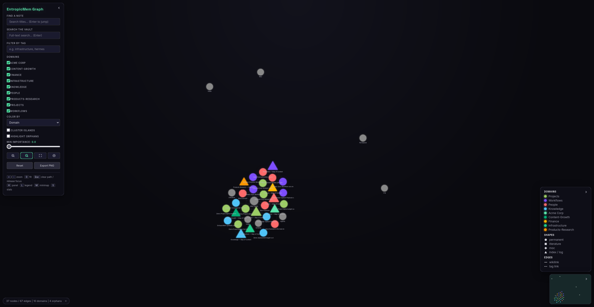
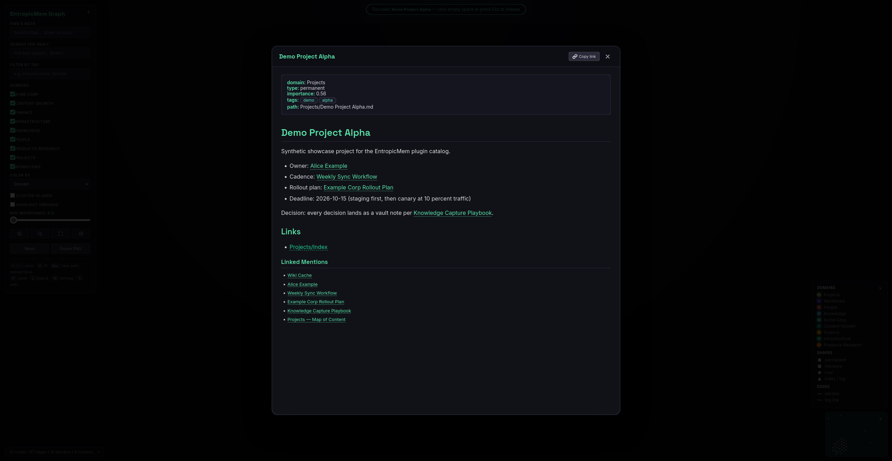
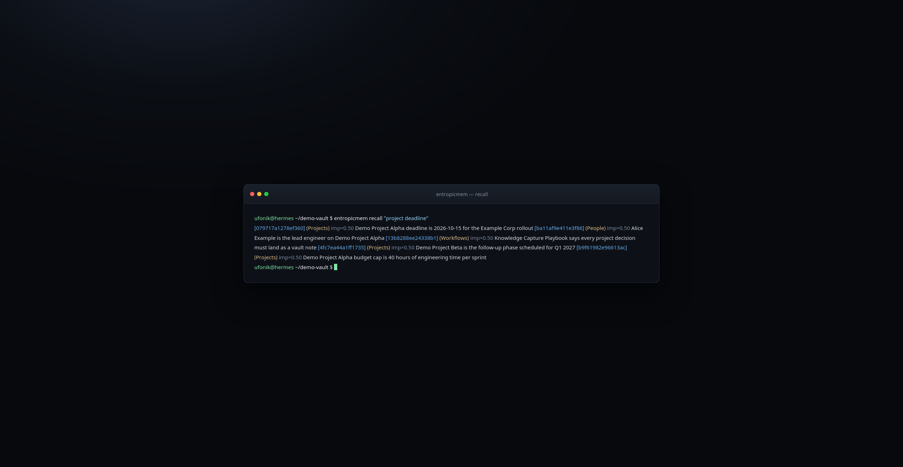
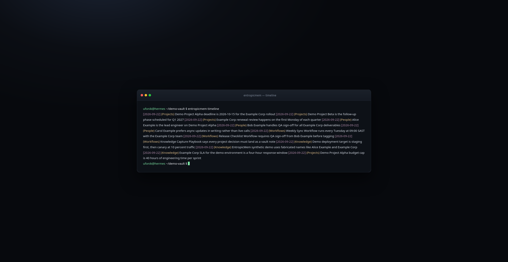
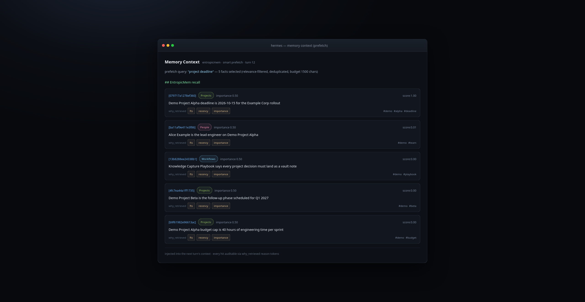

# EntropicMem: Standalone Agent Memory System

> A self-contained knowledge engine for Hermes Agent. SQLite memory, Markdown vault, visual graph, and a 34-command knowledge loop. Install from the Hermes plugin catalog or via `/learn`.

> **Public repo.** Never commit personal data: real names beyond the maintainer handle, home paths, emails, IPs, employer or client details, or memory/graph exports. See [CONTRIBUTING.md](CONTRIBUTING.md) for the rule and the pre-commit checklist.

[](LICENSE)
[](https://hermes-agent.nousresearch.com)
[](https://www.python.org/)
[](https://github.com/Ufonik88/EntropicMem/actions/workflows/test.yml)

---

## What It Is

A Hermes Agent memory provider and skill delivering a complete, standalone knowledge system:

| Component | What it does |
|-----------|--------------|
| **Memory engine** | Durable facts with FTS5 search, dedup, versioning, audit log, quarantine |
| **Episodic memory** | Session summaries with time-windowed recall |
| **Knowledge triples** | Subject, predicate, object graph with neighbors, paths, inconsistency checks |
| **Embeddings** | BGE-small vectors with hybrid FTS and vector recall (optional dep) |
| **Vault** | Human-browsable, linked, domain-organized Markdown notes |
| **Index** | Vault FTS5 plus graph edges powering cited retrieval |
| **Visual graph** | Self-contained D3 galaxy HTML export with lazy wikilink resolution |
| **MemoryProvider plugin** | 7 `entropicmem_*` tools and 5 lifecycle hooks wired into Hermes |

## Screenshots


| | |
|---|---|
|  | **Graph galaxy view:** the D3 visual graph colored by domain or community. |
|  | **Note modal:** full note body with wikilink navigation and tag chips. |
|  | **CLI recall:** fact search with explainable `why_retrieved` reason tokens. |
|  | **Timeline:** chronological fact and episode view with date filters. |
|  | **Prefetch context:** relevance-filtered facts injected into a turn. |

## Install

### Option A: Hermes plugin catalog (recommended)

```bash
hermes plugins install entropicmem
```

Then wire the provider in `~/.hermes/config.yaml` and bootstrap a vault:

```yaml
memory:
  provider: entropicmem
```

```bash
python3 ~/.hermes/plugins/entropicmem/scripts/entropicmem.py init
```

Full detail: [docs/SELF_INSTALL.md](docs/SELF_INSTALL.md).

### Option B: `/learn` skill flow

```bash
/learn https://github.com/Ufonik88/EntropicMem
```

The agent fetches the repo, installs the skill and plugin, bootstraps the vault, and smoke-tests in one pass. Follow [skills/entropicmem/SETUP.md](skills/entropicmem/SETUP.md) for the bootstrap checklist.

## Quickstart

All commands run through the engine CLI under the plugin directory, `python3 ~/.hermes/plugins/entropicmem/scripts/entropicmem.py`:

```bash
python3 ~/.hermes/plugins/entropicmem/scripts/entropicmem.py init                       # Bootstrap vault + memory engine
python3 ~/.hermes/plugins/entropicmem/scripts/entropicmem.py ingest "https://..."       # Source to notes
python3 ~/.hermes/plugins/entropicmem/scripts/entropicmem.py query "topic" --top-k 10   # Cited vault search
python3 ~/.hermes/plugins/entropicmem/scripts/entropicmem.py recall "durable fact"      # Memory engine search
python3 ~/.hermes/plugins/entropicmem/scripts/entropicmem.py remember "durable fact"    # Store in memory engine
python3 ~/.hermes/plugins/entropicmem/scripts/entropicmem.py graph export --format html # Galaxy graph (./export/graph.html)
```

## Repository Layout

```
EntropicMem/
├── plugins/entropicmem/         # Hermes MemoryProvider (7 tools, 5 hooks) + engine
│   ├── __init__.py              # MemoryProvider, config schema, tool handlers
│   ├── _backend.py              # Path resolution helpers
│   ├── plugin.yaml              # Catalog manifest
│   ├── scripts/                 # Engine + CLI (stdlib-only core)
│   │   ├── memory_engine.py     # SQLite FTS5 memory engine
│   │   ├── vault.py             # Markdown vault operations
│   │   ├── index.py             # Vault FTS5 index + graph edges
│   │   ├── retrieval.py         # Composed retrieval stack
│   │   ├── graph_export.py      # D3 galaxy visual graph
│   │   ├── policy.py / pii.py   # Write policy + PII redaction
│   │   ├── embeddings.py        # Vector search (optional)
│   │   └── entropicmem.py       # CLI
│   └── README.md                # Plugin quick reference
├── skills/entropicmem/          # /learn skill: instructions + references + templates
│   ├── SKILL.md                 # Agent instructions (loaded by /learn)
│   ├── SETUP.md                 # First-run bootstrap checklist
│   ├── references/              # Agent-facing docs (memory model, integration)
│   └── templates/vault/         # Seed vault skeleton used by `init`
├── scripts/graph_server/        # FastAPI graph server (token-gated)
├── benchmarks/                  # Frozen recall benchmark (corpus, probes, runner)
├── docs/                        # User-facing docs (see index below)
├── tests/                       # 600+ tests
└── .github/workflows/test.yml   # CI: pytest (3.10 to 3.12) + ruff + plugin validate
```

The engine lives under `plugins/entropicmem/scripts/` so the plugin directory is self-contained: a catalog install (`hermes plugins install entropicmem`) carries the full engine with it. The skill directory holds only instructions, references, and vault templates.

## Configuration

All settings live under `plugins.entropicmem` in `~/.hermes/config.yaml`. Every key is optional; defaults match the config schema in `plugins/entropicmem/__init__.py`.

```yaml
plugins:
  entropicmem:
    vault_path: ~/.hermes/entropicmem/vault
    memory_db: ~/.hermes/entropicmem/memory.db
    prefetch_token_budget: 1500
```

| Key | Default | What it does |
|-----|---------|--------------|
| `vault_path` | `~/.hermes/entropicmem/vault` | Vault directory for Markdown notes |
| `index_db` | `~/.hermes/entropicmem/index.db` | Vault index SQLite path (FTS + graph edges) |
| `memory_db` | `~/.hermes/entropicmem/memory.db` | Memory engine SQLite path (facts, episodes, triples) |
| `min_relevance_score` | `0.35` | Minimum combined relevance for prefetch injection (0.0 to 1.0) |
| `max_prefetch_results` | `5` | Maximum facts injected per turn |
| `prefetch_token_budget` | `1500` | Maximum characters of prefetch context per turn |
| `dedup_window` | `5` | Do not repeat a fact within N turns |
| `enabled_domains` | `[]` | Domains to draw prefetch from (empty means all) |
| `high_relevance_threshold` | `0.7` | High tier for progressive disclosure |
| `medium_relevance_threshold` | `0.4` | Medium tier for progressive disclosure |
| `context_window_turns` | `3` | Recent turns used to build the context-aware query |
| `max_context_query_length` | `1000` | Maximum length of the context-enhanced query |
| `cache_conversation_context` | `true` | Cache prefetch results with conversation awareness |
| `cache_ttl_seconds` | `300` | Prefetch cache TTL |
| `auto_extract_enabled` | `false` | Background regex fact extraction per turn (off by default) |
| `session_end_capture` | `true` | Flush a session digest episode when a session ends |
| `turn_cadence_flush_turns` | `40` | Flush a partial digest every N turns (0 disables) |
| `turn_cadence_min_interval_sec` | `1800` | Minimum seconds between cadence digest flushes |
| `session_extract_pending` | `true` | Run quarantine-first extraction at session end |
| `core_memory_enabled` | `true` | Inject Core Memory (Persona / User Profile) in prefetch |
| `core_memory_writable` | `false` | Allow `entropicmem_patch_core` to modify Core Memory |
| `prefetch_denied_sources` | `["auto_extracted", "test", "phase1_verify", "phase1_cron_context", "phase5", "phase5_e2e", "h2_test", "cron_self_test", "cron_path_test", "cutover_verify"]` | Fact source tags excluded from prefetch |
| `extraction_timeout` | `5.0` | Maximum seconds for background extraction per turn |
| `decay_enabled` | `true` | Temporal decay scoring in recall |
| `decay_half_life_days` | `90` | Half-life for memory decay |
| `decay_floor` | `0.5` | Minimum decay factor; non-durable facts are never erased |
| `evergreen_domains` | `["People"]` | Domains whose facts never decay |
| `touch_on_inject` | `true` | Bump `last_accessed` for injected facts (background write) |
| `reinforcement_boost` | `0.1` | Score boost per fact access (capped) |
| `reinforce_on_recall` | `false` | Bump access count on recall hits |

Smart context details (how relevance scoring, dedup, and progressive disclosure work): [skills/entropicmem/references/HERMES_INTEGRATION.md](skills/entropicmem/references/HERMES_INTEGRATION.md).

## Memory Model

Five cooperating layers, full model in [docs/MEMORY_MODEL.md](docs/MEMORY_MODEL.md):

| Layer | Where | Purpose |
|-------|-------|---------|
| **Hot cache** | `Wiki-Cache.md` | Instant orientation each session |
| **Facts** | `~/.hermes/entropicmem/memory.db` | Durable facts, episodes, triples, embeddings |
| **Vault** | Markdown files | Human-browsable, linked, domain-organized |
| **Index** | `~/.hermes/entropicmem/index.db` | Vault FTS5 + graph edges for retrieval |
| **Graph** | `export/graph.html` | D3 galaxy visualizer |

**Explainable recall:** every `recall()`, `recall_with_relevance()`, and `recall_hybrid()` hit carries a `why_retrieved` field, a deterministic list of reason tokens (`exact`, `fts`, `vector`, `recency`, `importance`, `triple`, `domain`; the LIKE fallback path also reports `fts`) so you can audit why a fact surfaced. The `entropicmem_recall` tool exposes it in its JSON output.

**Recall benchmark:** run `PYTHONPATH="plugins/entropicmem/scripts" python3 benchmarks/run_recall_bench.py` to measure `precision@5` and `MRR` against a frozen 98-fact corpus with 20 probes. CI enforces a floor (`precision@5 >= 0.50`, `MRR >= 0.50`).

## Commands

34 top-level commands in 9 groups. Full reference: [docs/CLI_REFERENCE.md](docs/CLI_REFERENCE.md). Invocations use `python3 ~/.hermes/plugins/entropicmem/scripts/entropicmem.py <command>`.

| Group | Commands |
|-------|----------|
| Vault & knowledge | `init`, `ingest`, `ingest-pile`, `query`, `note`, `research`, `lint`, `moc`, `hotcache`, `open` |
| Memory engine | `remember`, `recall`, `forget --confirm`, `memory stats/list/project/reindex`, `extract`, `reinforce`, `history`, `consolidate --confirm` |
| Episodic & triples | `episode add/list/stats`, `triple extract/list/stats/neighbors/path/inconsistencies` |
| Index & graph | `index rebuild/status`, `graph export/serve/show` |
| Vectors & time | `embed --rebuild`, `timeline` |
| Security | `security enable/disable/status`, `patch-core` |
| Portability | `export`, `import` |
| Provenance & sync | `migrate`, `shared-init`, `publish`, `pull` |
| Governance | `audit`, `pending list/promote/discard` |

## Hermes Integration

```yaml
# ~/.hermes/config.yaml
memory:
  provider: entropicmem
```

- **Interactive tools:** `entropicmem_remember`, `entropicmem_recall`, `entropicmem_query`, `entropicmem_patch_core`, `entropicmem_stats`, `entropicmem_get`, `entropicmem_consolidate`, plus the built-in `memory` tool.
- **Prefetch injection:** relevant facts are prefetched into `<memory-context>` each turn. These are system-injected context, not user input.
- **Lifecycle hooks (5):** `on_memory_write` mirrors built-in `memory` tool writes into the engine; `on_session_switch` tracks session state and resets caches; `on_session_end` writes an extractive session digest episode (idempotent per session) and runs quarantine-first extraction; `on_turn_start` flushes a partial digest every N turns for always-on sessions; `on_pre_compress` checkpoints a standing-constraints digest before context compression (fail-closed checkpoint API v2). Config under `plugins.entropicmem` (`session_end_capture`, `turn_cadence_flush_turns`, `turn_cadence_min_interval_sec`, `session_extract_pending`), see [docs/ARCHITECTURE.md](docs/ARCHITECTURE.md).
- **Cron:** Hermes cron runs execute with memory writes disabled; persist durable facts through the CLI or the MemoryEngine API (deterministic, no LLM), never through interactive memory tools.
- **Full integration guide:** [skills/entropicmem/references/HERMES_INTEGRATION.md](skills/entropicmem/references/HERMES_INTEGRATION.md).

## Security

- **Write policy:** secret and credential content is blocked. High-confidence `api_key` / `password` findings are auto-redacted; other PII types are recorded as warn-only findings. Auto-extracted facts are quarantined as pending until promoted.
- **Prompt-injection screen:** vault retrieval and prefetch, `recall`, and `get` tool payloads pass a local injection screen. Flagged content ships with a prominent warning marker rather than being dropped (flag-with-warning, fail-open by design: if the screen itself fails, text ships unmarked).
- **Vault path containment:** vault writes are confined to the resolved vault root.
- **Graph viewer:** note markdown is sanitized against stored XSS (rendered HTML from `marked` and lazy-fetched bodies pass a client-side sanitize pass).
- **Graph server:** loopback-only bind enforced at startup. Serving on a non-loopback address is refused unless `ENTROPICMEM_GRAPH_EXPOSE=1` explicitly opts in and `ENTROPICMEM_GRAPH_TOKEN` is set; read endpoints then require the `X-EntropicMem-Token` header. See [docs/VISUALIZER.md](docs/VISUALIZER.md).
- **Destructive gates:** `forget` and `consolidate` require `--confirm`; both auto-backup before running.
- **Audit log:** every write is append-only audited.
- **Backups:** AES-256-CBC encrypted before cloud upload. See [docs/BACKUP_RESTORE.md](docs/BACKUP_RESTORE.md).

## Documentation

| Doc | Content |
|-----|---------|
| [SETUP.md](SETUP.md) | First-run bootstrap checklist |
| [docs/SELF_INSTALL.md](docs/SELF_INSTALL.md) | Catalog and `/learn` install, verification, uninstall |
| [docs/MEMORY_MODEL.md](docs/MEMORY_MODEL.md) | The five-layer memory model + write policy |
| [docs/ARCHITECTURE.md](docs/ARCHITECTURE.md) | Component architecture, storage layout, data flow |
| [docs/CLI_REFERENCE.md](docs/CLI_REFERENCE.md) | All commands and subcommands |
| [docs/VISUALIZER.md](docs/VISUALIZER.md) | Graph UI: zoom, overlays, wikilink resolution, security model |
| [docs/BACKUP_RESTORE.md](docs/BACKUP_RESTORE.md) | Encrypted backup + restore drill |
| [docs/BACKFILL_PROCEDURE.md](docs/BACKFILL_PROCEDURE.md) | Opt-in shared-store backfill for multi-profile sync |
| [skills/entropicmem/references/HERMES_INTEGRATION.md](skills/entropicmem/references/HERMES_INTEGRATION.md) | MemoryProvider wiring + smart context |
| [CONTRIBUTING.md](CONTRIBUTING.md) | Public-repo rules + commit checklist |
| [CHANGELOG.md](CHANGELOG.md) | Release history |
| [benchmarks/run_recall_bench.py](benchmarks/run_recall_bench.py) | Recall benchmark runner (precision@5 / MRR) |

## Requirements

- Python 3.10+ (stdlib only for the core path)
- Optional: `sentence-transformers` for semantic search, `graphviz` for DOT export, `fastapi` + `uvicorn` for the graph server

## License

MIT
